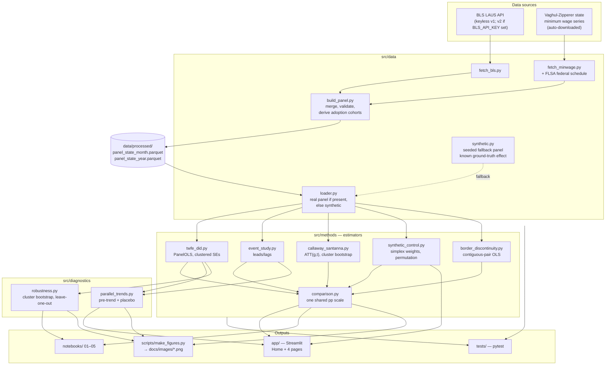
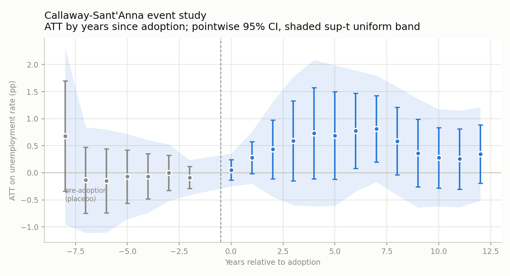
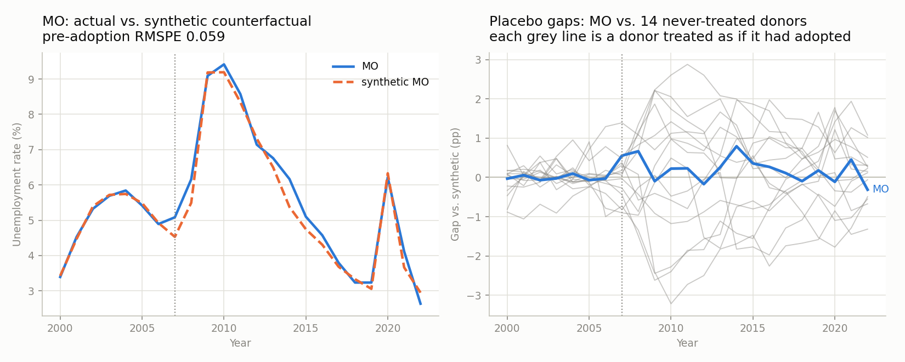

# Minimum Wage vs. Unemployment: Causal Inference

Estimates the causal effect of U.S. state minimum wage increases on
unemployment, using multiple causal inference methods so the results'
sensitivity to method choice is visible rather than hidden behind a single
number.

## Tech Stack


*Every estimator run on the same panel: monthly BLS unemployment crossed
with the Vaghul-Zipperer state minimum wage series, 51 jurisdictions,
2000-2022. The spread across identification strategies — not any one point
estimate — is the finding. Read the [findings](#findings) before quoting
any of these numbers.*

## Methods implemented

All in Python; there is no R dependency and no optional estimator.

- Two-way fixed effects DiD, continuous and binary treatment, optionally
  labour-force weighted (`src/methods/twfe_did.py`)
- Event-study / pre-trend check (`src/methods/event_study.py`)
- Callaway-Sant'Anna staggered-adoption DiD (`src/methods/callaway_santanna.py`)
- Abadie synthetic control, per-state and averaged over adopters
  (`src/methods/synthetic_control.py`)
- Border-discontinuity across contiguous state pairs
  (`src/methods/border_discontinuity.py`)
- Scale reconciliation across all of the above (`src/methods/comparison.py`)

## Architecture



### Walkthrough

Two sources feed the panel, and both fetch themselves: monthly state
unemployment rates from the BLS LAUS API (`fetch_bls.py`, keyless) and the
Vaghul-Zipperer historical state minimum wage series (`fetch_minwage.py`,
downloaded and cached from its GitHub release). `build_panel.py` merges
them, validates for duplicate/missing state-year-month rows, derives the
adoption cohorts, and writes both a state-month and a state-year parquet
into `data/processed/`.

Treatment is defined as a state's minimum wage binding above the federal
floor, and is modelled as **absorbing** — once a state legislates above the
federal minimum it stays treated, even in years a federal increase catches
up to it. That is what staggered-adoption estimators require; the
alternative would credit federal policy changes to state cohorts. The
resulting `adoption_year` splits the 51 jurisdictions into 15 never-treated,
11 always-treated (already above federal in 2000, so no clean pre-period),
and 25 staggered adopters between 2002 and 2021.

Collapsing months to years forces a second choice, and the annual wage and
the annual treatment flag have to make the same one. Both are read at
**year end**: `above_federal` is derived from the annual wage columns, so no
row can assert that a state is a minimum-wage state while recording its
minimum wage as the federal minimum. The two conventions disagree in 23
state-years — Kentucky was above the floor for part of 2007 only, and under
`any`-month plus absorbing treatment counted as an adopter for the next 16
years. `build_state_year_panel(..., treatment_convention="any-month")`
restores the other reading for sensitivity work.

The BLS pull also fetches the civilian labour force level. No estimator
uses it by default — every design here weights states equally — but it is
what makes `estimate_twfe(panel, weights="labor_force")` possible, so the
per-state/per-worker choice can be tested instead of merely inherited.

`fetch_minwage.py` also carries the statutory FLSA federal schedule, so a
substituted minimum wage source only has to supply state law — the federal
floor that defines treatment is filled in from statute. The schedule
reproduces the Vaghul-Zipperer federal series exactly across all 29,784 of
its rows, so swapping the source does not silently redefine treatment.

Everything downstream goes through **one** entry point, `src/data/loader.py`,
which returns `(panel, is_synthetic)`: the real processed panel if it exists,
otherwise a seeded synthetic panel from `synthetic.py` that has a known
ground-truth elasticity baked in. That's what makes the whole repo runnable
before any data is fetched, and what lets the estimators be graded against a
known answer.

The five estimators are all plain Python — `linearmodels`/`statsmodels` for
the regression designs, numpy for Callaway-Sant'Anna's group-time ATTs,
scipy for synthetic control's simplex-constrained weights. Earlier versions
of this repo shelled out to R for the last two; that is gone, along with the
subprocess bridge and the pages that used to disable themselves when
`Rscript` was missing.

`src/methods/comparison.py` is what makes the headline figure honest. The
estimators do not natively answer the same question: the continuous TWFE
and the border design regress on *log* minimum wage, so their coefficients
are semi-elasticities, while Callaway-Sant'Anna, the event study, synthetic
control and the binary TWFE estimate a *binary* treatment effect in
percentage points. Plotting those on a shared axis without conversion
compares numbers that mean different things. `comparison.py` multiplies the
semi-elasticities by the average log gap between the state and federal
minimum among treated state-years (0.178 for this panel, a ~19% average
premium over federal), and records in a `scale` column which rows rest on
that step — `converted` for the rescaled rows, `native` for the ones already
in percentage points, `conditional` for the synthetic control's
conditional-on-fitted-effects interval, and `failed` for an estimator that
raised, which becomes a row carrying its error rather than taking the table
down.

`src/diagnostics` consumes estimator output rather than data: a joint Wald
test over the pre-adoption leads plus the per-coefficient screen and
placebo (randomized-timing) tests in `parallel_trends.py`, cluster
bootstrap and leave-one-state-out sensitivity in `robustness.py`. Every
routine that refits the model many times counts the refits that *failed*
and raises past a threshold, because a bootstrap distribution over an
unknown number of survivors is not a bootstrap distribution.

Three surfaces consume all of the above: the Streamlit app for interactive
exploration, the numbered notebooks for the methodology narrative, and
`scripts/make_figures.py` for the static PNGs in this README.

### Directory responsibilities

| Path | Responsibility |
| --- | --- |
| `src/data/` | Acquisition (`fetch_bls.py`, `fetch_minwage.py`), panel construction and validation (`build_panel.py`), the seeded synthetic fallback (`synthetic.py`), and the single load entry point (`loader.py`) |
| `src/methods/` | The five estimators, plus `comparison.py`, which puts them on one interpretable scale |
| `src/diagnostics/` | Design checks that run *on* estimator output — pre-trend/placebo (`parallel_trends.py`), bootstrap and leave-one-out (`robustness.py`) |
| `src/viz/` | Reserved for shared plotting helpers (currently empty) |
| `app/` | Streamlit UI: `Home.py` plus four pages (Data Explorer, DiD Estimator, Synthetic Control, Method Comparison) |
| `notebooks/` | Methodology walkthroughs `01`–`05`, meant to be read in order |
| `scripts/` | `make_figures.py` regenerates every analytical figure in this README; `capture_app.py` retakes the app screenshots |
| `data/` | `raw/` (API pulls, supplied CSVs) → `interim/` → `processed/` (analysis panels). Gitignored except for `.gitkeep` and the committed `manifest.json` vintage record |
| `tests/` | pytest suite over the panel builder, the minimum wage loader, the panel loader, the estimators, the comparison table, the data manifest, and the diagnostics |

## Findings

Every estimate below is the average treatment effect on the treated, in
percentage points of unemployment — the effect of the minimum wage policy
treated states actually enacted, not of a hypothetical one-log-point rise.
The unit of analysis is the **state-year, weighted equally**: see the third
bullet below for what changes when it is not.

Reproduced by `python -m src.methods.comparison`. The data vintage these
numbers came from is recorded in [`data/manifest.json`](data/manifest.json)
and printed by `python -m src.data.manifest`; LAUS is revised, so the same
code run a year from now will not produce quite the same table.

| Method | ATT (pp) | 95% CI | Scale |
| --- | --- | --- | --- |
| TWFE DiD (log minimum wage) | +0.10 | [−0.11, +0.32] | converted |
| TWFE DiD (binary treatment) | +0.36 | [+0.01, +0.70] | native |
| Event study (post-period avg) | +0.47 | [+0.08, +0.86] | native |
| Callaway-Sant'Anna | +0.56 | [+0.16, +0.96] | native |
| Synthetic control (avg over adopters) | +0.64 | [+0.32, +0.95] | conditional |
| Border discontinuity | −0.01 | [−0.18, +0.15] | converted |

Four of the six intervals exclude zero, and five of the six point estimates
are positive — higher unemployment in states that raised their minimum
wage. **That is not a finding this repo can support**, for reasons worth
stating plainly:

- **The placebo test does not clear.** Reassigning treatment timing at
  random reproduces an effect at least this large in 38% of 60 draws (none
  of which failed to fit). An estimate that randomly-timed treatment
  matches more than a third of the time is not evidence of a policy effect;
  it is evidence that state-year unemployment is autocorrelated enough to
  manufacture one.
- **The synthetic control's interval and its own permutation test
  disagree.** [+0.32, +0.95] is conditional on the fitted per-unit effects:
  it describes the spread of 21 point estimates, treating each as if it
  were data. Abadie permutation inference — re-running each adopter's fit
  pretending a donor was treated, which is the inference this design
  actually supports — gives a combined p of 0.28, and **not one** of the 21
  adopters is individually significant at 0.05. The `scale` column reads
  `conditional` for that row for this reason.
- **Weighting reverses the significance.** Every estimator here weights
  state-years equally, so Wyoming counts as much as California. Weight the
  binary TWFE by labour force instead and it falls from +0.36 (p = 0.04)
  to +0.14 (p = 0.53). Whatever the equal-weighted specification picks up
  is concentrated in small states, and "per state" versus "per worker" is a
  choice this repo makes rather than a fact it discovers.
- **The border design finds nothing.** Once identification comes from
  within-pair variation over time — pair and period fixed effects, all 109
  contiguous pairs, two-way clustered on both states — the estimate is
  −0.01 [−0.18, +0.15]. The +0.37 this README used to report came from a
  pooled regression on a hand-picked 28-pair subset concentrated in CA/OR/NV
  and NY/NJ/PA, which is to say a sample selected on treatment and a slope
  free to absorb permanent level differences between pairs.
- **Adoption is endogenous.** States raise their minimum wage when their
  labour markets are strong and the politics allow it, and the states that
  never do are systematically different — the 15 never-treated are entirely
  Southern and Mountain/Plains states (AL, GA, ID, IN, KS, KY, LA, MS, ND,
  OK, SC, TN, TX, UT, WY), which is a regional control group, not a random
  one. Parallel trends is doing enormous work here, and no diagnostic in
  this repo tests the selection mechanism itself.
- **The spread is the point.** The two TWFE rows differ from each other by
  more than either differs from Callaway-Sant'Anna. Only the binary row is
  a like-for-like comparison against CS; the gap between them (+0.36 vs
  +0.56) is the staggered-timing bias the Goodman-Bacon decomposition
  describes. The continuous row's distance from CS mixes that bias with the
  negative-weighting problem of a dose-response design and with a units
  conversion, so it localises how much of the answer is a modelling choice.

What the panel does support: the formal parallel-trends test does not
reject (joint Wald over the four pre-adoption event-study leads,
χ²(4) = 3.70, p = 0.45 — non-rejection, which is not the same as evidence
the assumption holds), and no single state drives the result — the
leave-one-state-out refits range from +0.35 (dropping NV) to +0.82
(dropping RI) around a full-sample +0.58 in semi-elasticity terms, without
a sign flip. Those are necessary conditions, not sufficient ones.

Treat this repo as a demonstration that five identification strategies can
be implemented, reconciled onto one scale, and made to disagree in
interpretable ways — not as an empirical claim about U.S. minimum wage
policy.

## Figures

All generated by running the repo's own estimation code against the real
panel:

```
python -m scripts.make_figures
```

### Treated vs. never-treated states


Mean unemployment for states that ever raise their minimum wage above the
federal floor versus those that never do. The two series track each other's
business-cycle swings closely, which is the visual precondition DiD relies
on. Note the level gap that opens after 2010 and the sharper 2020 spike in
treated states — the kind of divergence a DiD design attributes to policy
and a sceptic attributes to composition.

### Outcome path around adoption


The same outcome re-centred on each treated state's own adoption year, so
staggered timing doesn't smear the picture. Shaded band is ±1.96 SE of the
cross-state mean.

### Event study


Leads and lags from `src/methods/event_study.py`, TWFE with state-clustered
standard errors, `t = -1` omitted as the reference period. Always-treated
states are dropped (they have no pre-period) and the 15 never-treated
states are kept as controls at `rel_time = NA`, so the leads and lags are
identified against states that never adopt rather than against each other.
The pre-period coefficients are flat, and the formal check
(`parallel_trends.pretrend_joint_test`, a joint Wald test over all four
leads using the fitted clustered covariance) does not reject: χ²(4) = 3.70,
p = 0.45. The post-period drifts upward; its average is a linear contrast
over the six post coefficients, not an average of per-coefficient interval
endpoints, which would ignore their covariance.

### Callaway-Sant'Anna event study



The same picture built from comparisons that never use an already-treated
state as a control. Grey pre-adoption points are placebo cells. The shaded
band is a sup-t uniform band, which covers all event times simultaneously
rather than one at a time — noticeably wider than the pointwise intervals,
and wide enough to include zero throughout.

### Synthetic control



One state's counterfactual built from a weighted blend of never-treated
donors (left), and Abadie permutation inference (right): the same procedure
re-run pretending each donor was treated. The treated state's gap has to
stand out against those grey lines to mean anything — and across the 21
adopters that clear the pre-fit RMSPE gate, not one does at the 0.05 level.
That is the inference this design supports, and it is the reason the
headline synthetic-control interval is labelled `conditional`.

### Placebo test


`placebo_test` re-runs TWFE 60 times with each state handed another
state's entire minimum wage history — whole donor paths, so each remains
internally coherent while losing its link to that state's labour market.
The actual estimate sits inside the bulk of the placebo distribution, not
its tail: 38% of 60 draws are at least as large in magnitude, over a
denominator of *attempted* draws (none failed here). This is the figure
that should temper everything else in this README.

### Leave-one-state-out


The TWFE coefficient refit with each state dropped in turn
(`src/diagnostics/robustness.leave_one_state_out`). The estimate ranges from
+0.35 (dropping NV) to +0.82 (dropping RI) around a full-sample +0.58,
without crossing zero, so the result isn't one state's story. Refits that
fail are counted rather than dropped; past a 10% failure rate the routine
raises instead of returning a thinner sample that looks complete.

## The app

```
streamlit run app/Home.py
```


Every page runs against whichever panel `loader.py` finds, and says which
one it is. The Method Comparison page runs all six specifications through
`comparison.py`; the Synthetic Control page fits a case study on demand and
will optionally run permutation inference over the donor pool.

## Setup

```
python -m venv .venv
.venv\Scripts\activate   # Windows
pip install -r requirements.txt
```

That's the whole setup. Python 3.11–3.13; every dependency is bounded on
both sides in `requirements.txt` and `pyproject.toml`, and CI runs the
suite on all three versions plus `ruff`.

No R, and no API key — `fetch_bls.py` uses the
keyless BLS v1 endpoint, which is enough to build the full 51-state panel.
Setting `BLS_API_KEY` (free, from https://www.bls.gov/developers/) in a
`.env` file switches it to the v2 endpoint, which has looser per-request
limits and a higher daily quota — useful if you widen the year range.

## Usage

Build the real panel — no key or manual download needed:

```
python -m src.data.fetch_bls      # BLS LAUS, 51 states, 2000-2022
python -m src.data.build_panel    # merge, validate, derive adoption cohorts
python -m src.data.manifest       # print the recorded data vintage
```

Both fetchers cache to `data/raw/`, so re-running is offline and free. Each
also records the vintage in `data/manifest.json` — SHA-256 and mtime per
raw input, the BLS API version and measures pulled, and which minimum wage
source was actually used. That file is committed even though `data/` is
not, because it is the only way to say which BLS revision produced a given
number; `python -m src.data.manifest` also reports whether the files on
disk still match it.
`src/data/loader.py` (used by the app, notebooks, and figure script)
prefers `data/processed/panel_state_year.parquet` once it exists, and falls
back to the seeded synthetic panel until then — so everything below runs
before you fetch anything, against data with a known ground-truth effect.

To substitute a different minimum wage source, drop a CSV with columns
`state, year, month, minimum_wage` at `data/raw/state_minimum_wage.csv` and
it takes precedence over the download. `federal_minimum_wage` is optional
there; missing values are filled from the FLSA schedule in
`fetch_minwage.py`.

Then:

- Explore the pipeline and each method in `notebooks/` (run in order,
  01 through 05). To execute from the CLI:
  ```
  jupyter kernelspec list   # confirm/register a kernel for this venv, e.g.:
  python -m ipykernel install --user --name mwci --display-name "Python (mwci)"
  jupyter nbconvert --to notebook --execute --inplace --ExecutePreprocessor.kernel_name=mwci notebooks/01_data_pipeline_demo.ipynb
  ```
- Run the interactive app:
  ```
  streamlit run app/Home.py
  ```
- Regenerate this README's figures:
  ```
  python -m scripts.make_figures
  ```
- Retake this README's app screenshots (needs `pip install playwright &&
  python -m playwright install chromium`):
  ```
  python -m scripts.capture_app
  ```
- Run tests:
  ```
  pytest
  ```

## Known gaps

- **The panel ends in 2022**, because the Vaghul-Zipperer series does. The
  post-2021 state minimum wage increases — the largest in the sample period
  — are therefore represented by at most one post-treatment year, and the
  2021 adoption cohort contributes almost nothing to the estimates.
- **No covariates.** Every estimate is unconditional: no controls for
  industry mix, demographics, or state-level business-cycle exposure. The
  synthetic control implementation accepts covariates and the panel builder
  could carry them, but nothing supplies them, so parallel trends has to
  hold unconditionally. This is the single largest gap between this repo and
  a publishable design.
- **Unemployment rate is the wrong outcome for this literature.** The
  minimum wage debate is about *employment* — teen employment, restaurant
  employment, hours — and the unemployment rate moves with labour force
  participation too, so a disemployment effect can show up as a *fall* in
  measured unemployment if discouraged workers exit. LAUS publishes
  employment levels; wiring those in as a second outcome is the most
  valuable next change.
- **The border design uses state-level, not county-level, data.** The
  identifying appeal of Dube-Lester-Reich is comparing adjacent *counties*
  across a state line, where local labour markets are genuinely shared.
  `US_STATE_BORDER_PAIRS` is now the complete enumeration of all 109
  contiguous jurisdiction pairs rather than a hand-picked subset, and the
  specification carries pair and period fixed effects with two-way
  clustering — but it still compares whole states that happen to touch,
  which is a much weaker version of the argument. County-level LAUS data
  exists and would make this design mean what its name implies.
- **The weighted specification is only wired into TWFE.** `weights=` exists
  on `estimate_twfe`/`estimate_twfe_binary`, so the per-state versus
  per-worker question can be asked of the workhorse design. Callaway-
  Sant'Anna, the event study, synthetic control and the border design are
  all still equal-weighted, so the headline table cannot be reproduced
  per-worker end to end.
- **Always-treated states are dropped, not modelled.** The 11 jurisdictions
  already above the federal floor in 2000 have no pre-period and fall out of
  every staggered-adoption estimator. They include the largest
  high-minimum-wage states, so the estimates describe later adopters.
