# Minimum Wage vs. Unemployment: Causal Inference

Estimates the causal effect of U.S. state minimum wage increases on
unemployment, using multiple causal inference methods so the results'
sensitivity to method choice is visible rather than hidden behind a single
number.

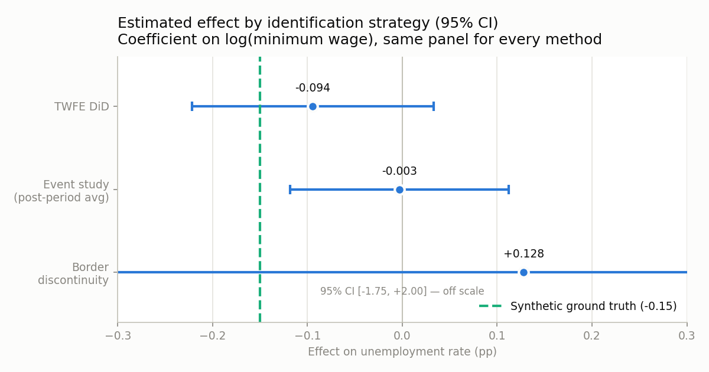

*Every estimator run on the same panel. The spread across identification
strategies — not any one point estimate — is the finding. Figures in this
README are generated by `python -m scripts.make_figures` against the seeded
synthetic panel (see [Known gaps](#known-gaps)); the dashed line is that
panel's baked-in ground truth.*

## Methods implemented

- Two-way fixed effects DiD (`src/methods/twfe_did.py`)
- Event-study / pre-trend check (`src/methods/event_study.py`)
- Callaway-Sant'Anna staggered-adoption DiD (`src/methods/callaway_santanna.R`)
- Synthetic control case studies (`src/methods/synthetic_control.R`)
- Border-discontinuity (contiguous county pairs) (`src/methods/border_discontinuity.py`)

## Architecture

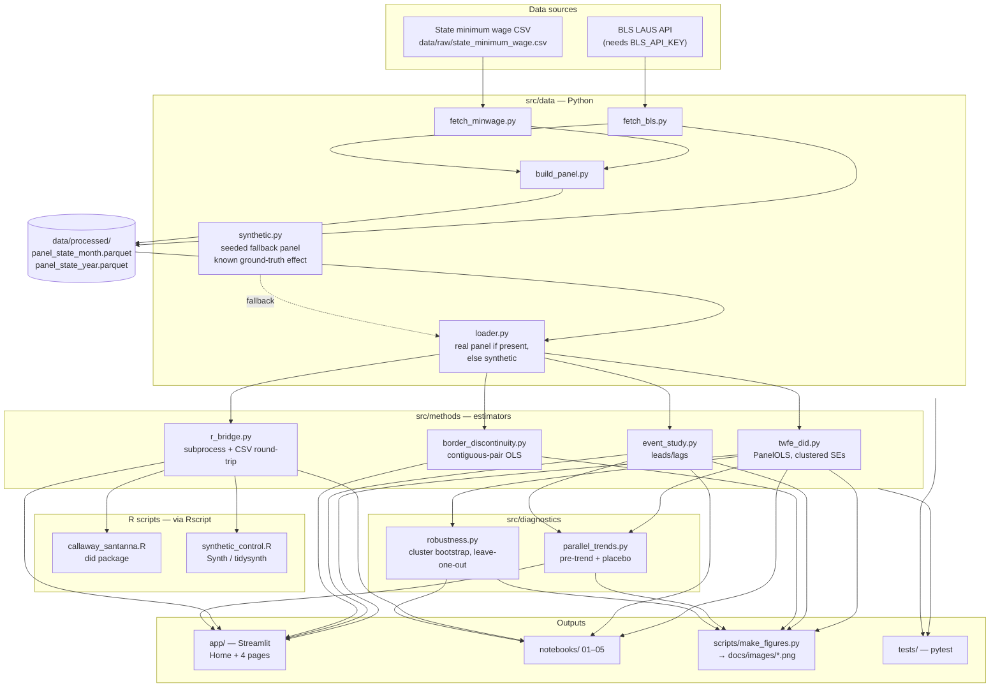

### Walkthrough

Two sources feed the panel: monthly state unemployment rates from the BLS
LAUS API (`fetch_bls.py`, needs a key) and a state minimum wage history CSV
you supply (`fetch_minwage.py`). `build_panel.py` merges them, validates for
duplicate/missing state-year-month rows, and writes both a state-month and a
state-year parquet into `data/processed/`.

Everything downstream goes through **one** entry point, `src/data/loader.py`,
which returns `(panel, is_synthetic)`: the real processed panel if it exists,
otherwise a seeded synthetic panel from `synthetic.py` that has a known
ground-truth elasticity baked in. That's what makes the whole repo runnable
with no API key, and what lets the estimators be graded against a known
answer.

The estimators split across two languages. The Python side
(`twfe_did.py`, `event_study.py`, `border_discontinuity.py`) uses
`linearmodels`/`statsmodels` directly. The two estimators with no good Python
equivalent stay in R: `callaway_santanna.R` (the `did` package) and
`synthetic_control.R` (`Synth`/`tidysynth`). They are reached from Python
through `r_bridge.py`, which shells out to `Rscript` and round-trips the panel
through temporary CSVs — so there is no `rpy2` dependency, and the R half
degrades gracefully (the app disables those pages when `Rscript` isn't on
PATH) rather than breaking the Python half.

`src/diagnostics` consumes estimator output rather than data: pre-trend
screening and placebo (randomized-timing) tests in `parallel_trends.py`,
cluster bootstrap and leave-one-state-out sensitivity in `robustness.py`.

Three surfaces consume all of the above: the Streamlit app for interactive
exploration, the numbered notebooks for the methodology narrative, and
`scripts/make_figures.py` for the static PNGs in this README.

### Directory responsibilities

| Path | Responsibility |
| --- | --- |
| `src/data/` | Acquisition (`fetch_bls.py`, `fetch_minwage.py`), panel construction and validation (`build_panel.py`), the seeded synthetic fallback (`synthetic.py`), and the single load entry point (`loader.py`) |
| `src/methods/` | The estimators. Python: TWFE DiD, event study, border discontinuity. R: Callaway-Sant'Anna, synthetic control, reached via `r_bridge.py` |
| `src/diagnostics/` | Design checks that run *on* estimator output — pre-trend/placebo (`parallel_trends.py`), bootstrap and leave-one-out (`robustness.py`) |
| `src/viz/` | Reserved for shared plotting helpers (currently empty) |
| `app/` | Streamlit UI: `Home.py` plus four pages (Data Explorer, DiD Estimator, Synthetic Control, Method Comparison) |
| `notebooks/` | Methodology walkthroughs `01`–`05`, meant to be read in order |
| `scripts/` | `make_figures.py` — regenerates every analytical figure in this README |
| `data/` | `raw/` (API pulls, supplied CSVs) → `interim/` → `processed/` (analysis panels). Gitignored except for `.gitkeep` |
| `tests/` | pytest suite over the panel builder, estimators, diagnostics, and the R bridge's Python-side contract |
| `install.R` | Installs the R packages the two `.R` estimators need |

## Figures

All generated by running the repo's own estimation code:

```
python -m scripts.make_figures
```

### Treated vs. never-treated states

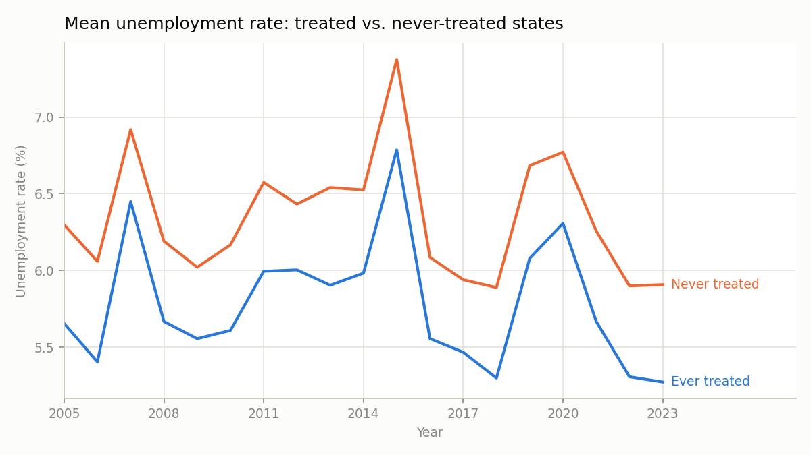

Mean unemployment for states that ever raise their minimum wage above the
federal floor versus those that never do. The two series track each other's
business-cycle swings closely, which is the visual precondition DiD relies on.

### Outcome path around adoption

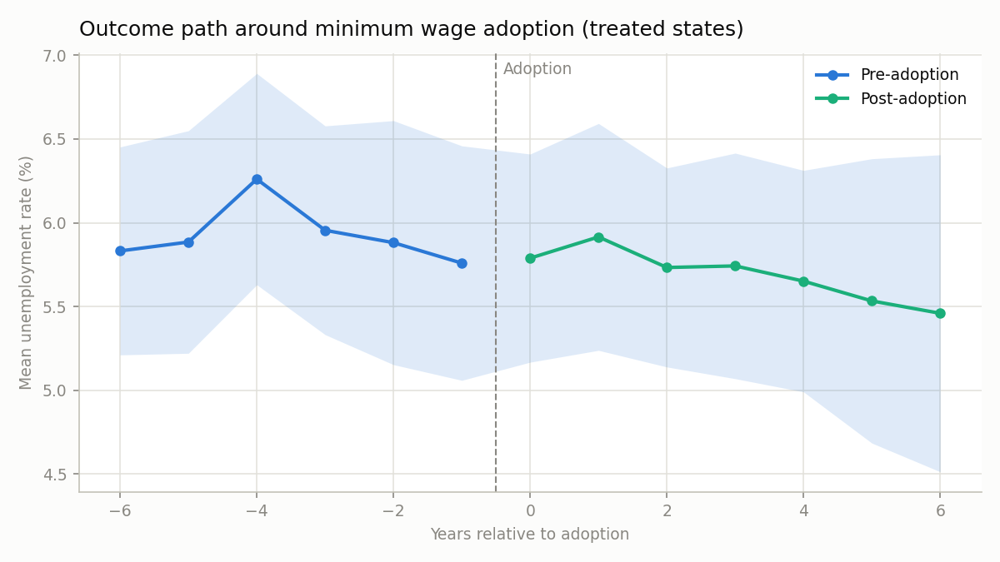

The same outcome re-centred on each treated state's own adoption year, so
staggered timing doesn't smear the picture. Shaded band is ±1.96 SE of the
cross-state mean.

### Event study

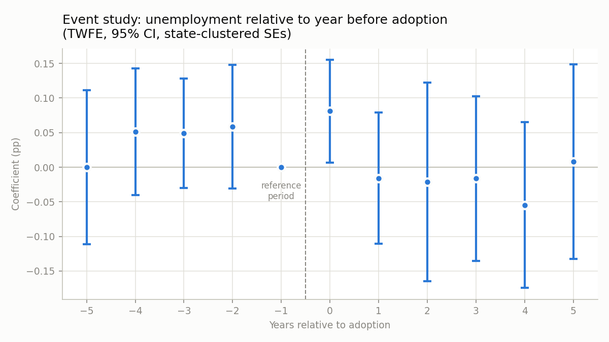

Leads and lags from `src/methods/event_study.py`, TWFE with state-clustered
standard errors, `t = -1` omitted as the reference period. Flat, insignificant
pre-period coefficients are the formal parallel-trends check
(`src/diagnostics/parallel_trends.pretrend_joint_test`).

### Placebo test

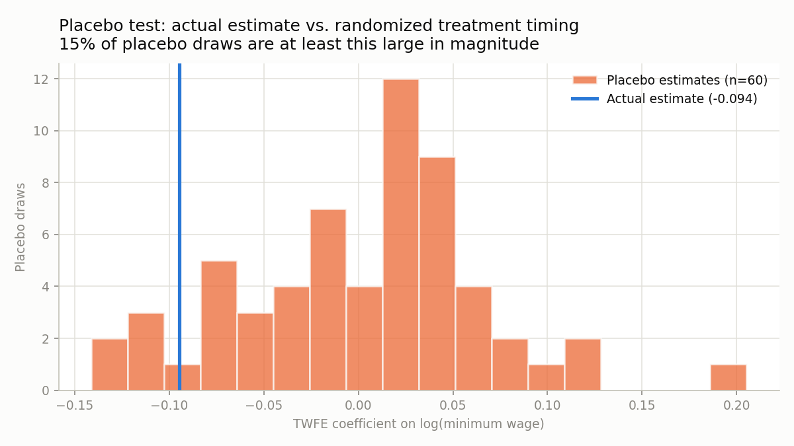

`placebo_test` re-runs TWFE 60 times with treatment timing randomly
reassigned across states. The actual estimate sits inside the placebo
distribution's left tail but is not an extreme outlier — consistent with the
estimate's own CI covering zero.

### Leave-one-state-out

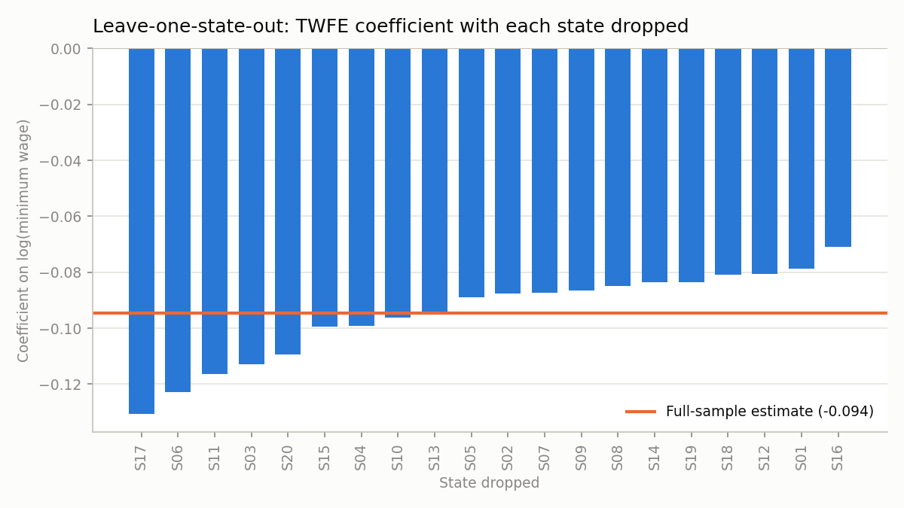

The TWFE coefficient refit with each state dropped in turn
(`src/diagnostics/robustness.leave_one_state_out`). No single state moves the
estimate across zero, so the result isn't one state's story.

## The app

`streamlit run app/Home.py` — screenshots below are of the app running
against the synthetic panel.

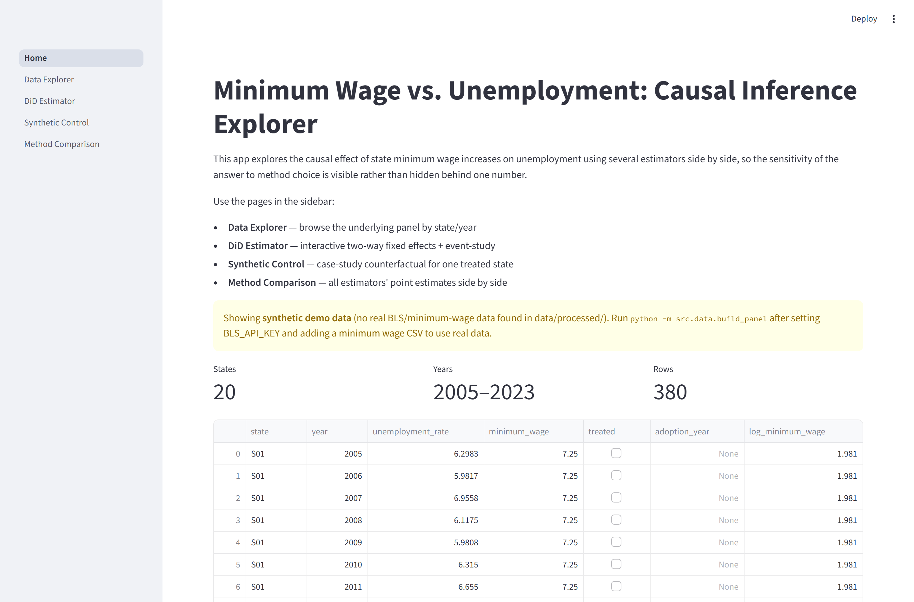

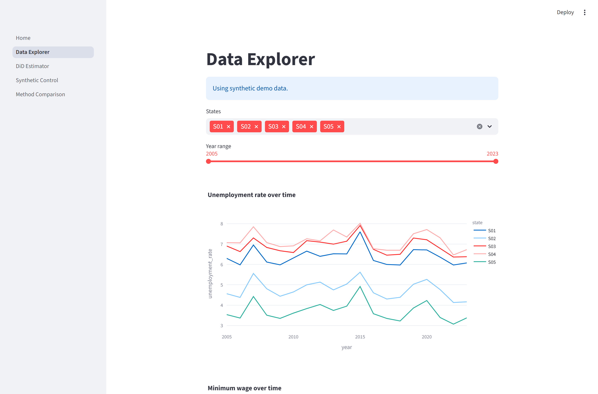

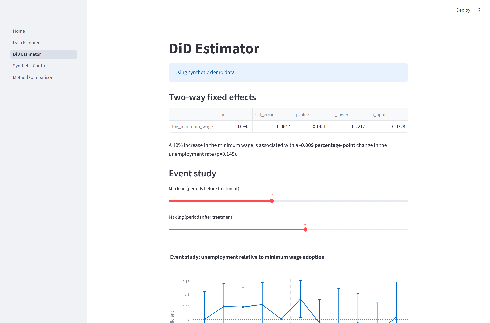

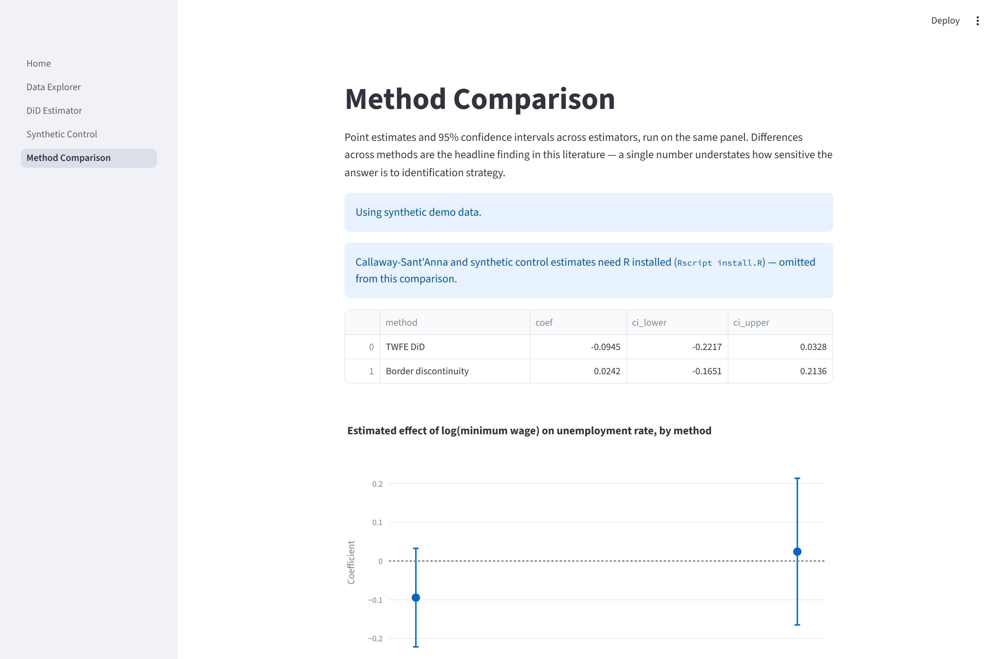

The Method Comparison page shows the R-backed estimators being skipped
cleanly when `Rscript` isn't on PATH — the Python estimates still render.

## Setup

### Python

```
python -m venv .venv
.venv\Scripts\activate   # Windows
pip install -r requirements.txt
```

### R

Requires R installed and on PATH. Then:

```
Rscript install.R
```

R is optional: without it the Callaway-Sant'Anna and synthetic control
estimators are skipped and everything else still runs.

### API key

BLS API pulls need a free key from https://www.bls.gov/developers/. Copy
`.env.example` to `.env` and set `BLS_API_KEY`.

## Usage

**Without real data**: everything below runs out of the box against a
seeded synthetic panel (`src/data/synthetic.py`) with a known ground-truth
effect, so you can explore the pipeline before wiring up BLS/minimum-wage
data.

**With real data**:
1. Set `BLS_API_KEY` (see above) and add a state minimum wage history CSV
   to `data/raw/state_minimum_wage.csv` (see `src/data/fetch_minwage.py`
   docstring for the required columns and where to find the data).
2. Build the panel:
   ```
   python -m src.data.fetch_bls
   python -m src.data.build_panel
   ```
   `src/data/loader.py` (used by the app, notebooks, and figure script)
   automatically prefers `data/processed/panel_state_year.parquet` once it
   exists.

Then:
- Explore the pipeline and each method in `notebooks/` (run in order,
  01 through 05). To execute from the CLI:
  ```
  jupyter kernelspec list   # confirm/register a kernel for this venv, e.g.:
  python -m ipykernel install --user --name mwci --display-name "Python (mwci)"
  jupyter nbconvert --to notebook --execute --inplace --ExecutePreprocessor.kernel_name=mwci notebooks/01_data_pipeline_demo.ipynb
  ```
- Run the interactive app:
  ```
  streamlit run app/Home.py
  ```
- Regenerate this README's figures:
  ```
  python -m scripts.make_figures
  ```
- Run tests:
  ```
  pytest
  ```

## Known gaps

- **All figures and screenshots above are from the synthetic panel.** No
  real BLS/minimum-wage data has been fetched (no API key was available
  while building this), so the numbers are a demonstration that the
  pipeline works end to end, not an empirical finding about U.S. minimum
  wage policy. Re-run `python -m scripts.make_figures` after building the
  real panel and they will regenerate from it automatically.
- **R-dependent estimators are unverified on this machine** (Callaway-
  Sant'Anna and synthetic control) — R isn't installed here. The Python
  side (`r_bridge.py`, input validation, error handling) is tested; the
  `.R` scripts themselves need a run with R + the `did`/`Synth` packages
  installed to confirm end-to-end. This is why they are absent from the
  method comparison figure.
- The border-discontinuity figure pairs synthetic states arbitrarily —
  `S01–S02`, `S03–S04`, … — because synthetic states have no geography.
  Its confidence interval is correspondingly enormous and runs off the
  chart's scale. With real data, `US_STATE_BORDER_PAIRS` in
  `src/methods/border_discontinuity.py` supplies genuine contiguous pairs.
- The event-study and Callaway-Sant'Anna estimators need an `adoption_year`
  column (staggered treatment timing), which the synthetic panel has but
  the real `build_panel.py` pipeline does not yet compute from the
  minimum wage panel — add that derivation when wiring in real data.
